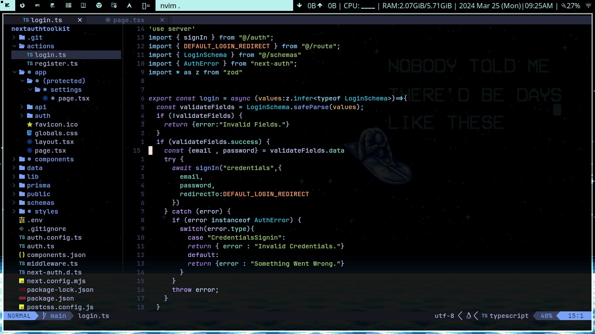

# Oblivion-vim - Simple and Minimal NeoVim Config

Oblivion-vim is a lightweight and minimal NeoVim configuration written in Lua. It aims to provide essential features for a smooth and efficient coding experience, including LSP (Language Server Protocol), TreeSitter, file tree navigation, and GitHub Copilot-like code assistance.

## Features
- **LSP Integration**: Seamless integration with Language Server Protocol for intelligent code completion, diagnostics, and more.
- **TreeSitter**: Advanced syntax highlighting and code analysis for enhanced readability and navigation.
- **File Tree**: Convenient file tree navigation for easy project exploration.
- **GitHub Copilot Support**: Enjoy code assistance similar to GitHub Copilot for improved productivity.

## Installation
To use Oblivion-vim, follow these simple steps:

1. Clone the Oblivion-vim repository:
   ```
   git clone https://github.com/yourusername/Oblivion.git ~/.config/nvim
   ```

2. Install required plugins:
   Open NeoVim and run the following command:
   ```
   :PackerInstall
   ```

## Setup
To customize Oblivion-vim according to your preferences, modify the `init.lua` file located in `~/.config/nvim`.

### Available Options:
- Adjust key mappings.
- Add or remove plugins.
- Customize LSP configurations.
- Fine-tune TreeSitter settings.

## Demo Images




## License
This project is licensed under the MIT License - see the [LICENSE](LICENSE) file for details.

## Contributions
Contributions are welcome! Feel free to open an issue or submit a pull request.

## Acknowledgments
Special thanks to the NeoVim community and the creators of the plugins used in this configuration.

---
