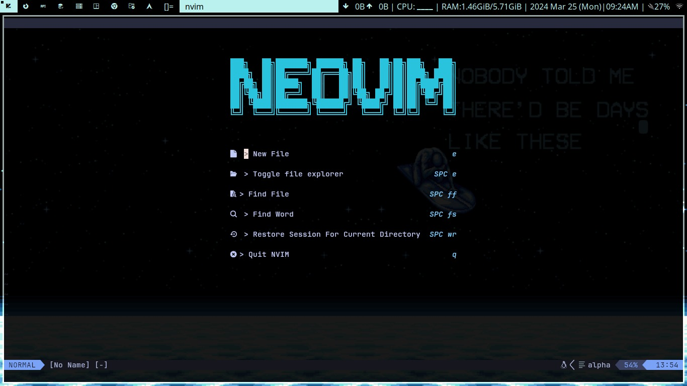
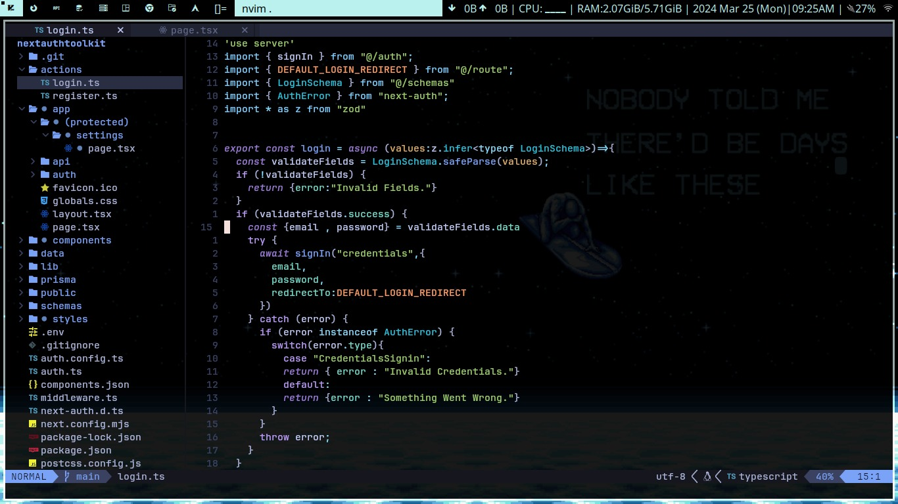

<div align="center">

```
██╗  ██╗ █████╗ ██╗   ██╗███╗   ███╗██╗   ██╗██████╗ ██╗
██║ ██╔╝██╔══██╗██║   ██║████╗ ████║██║   ██║██╔══██╗██║
█████╔╝ ███████║██║   ██║██╔████╔██║██║   ██║██║  ██║██║
██╔═██╗ ██╔══██║██║   ██║██║╚██╔╝██║██║   ██║██║  ██║██║
██║  ██╗██║  ██║╚██████╔╝██║ ╚═╝ ██║╚██████╔╝██████╔╝██║
╚═╝  ╚═╝╚═╝  ╚═╝ ╚═════╝ ╚═╝     ╚═╝ ╚═════╝ ╚═════╝ ╚═╝
```

**कौमुदी** — *moonlight for your editor*

A fast, transparent, and opinionated Neovim config built on **Neovim 0.12+** native APIs.

Rose Pine Moon default · 6 premium themes · 42 plugins · pure Lua

[](https://neovim.io)
[](https://lua.org)
[](LICENSE)

</div>

---

## ✨ What is Kaumudi?

**Kaumudi** (कौमुदी) — Sanskrit for *moonlight* — is a personal Neovim configuration that prioritises transparency, speed, and modern Neovim APIs. Every window, panel, and popup is transparent so your terminal background shines through. It ships with 6 hand-tuned colorschemes, a Telescope-powered theme picker, and first-class LSP support for 11 languages — all managed through lazy.nvim.

> **Philosophy:** Zero bloat. Every plugin earns its place. Native APIs over shims.

---

## 📸 Screenshots

<div align="center">

| Dashboard | Editor |
|:-:|:-:|
|  |  |

</div>

---

## 🚀 Installation

**Prerequisites:** Neovim ≥ 0.12 · Node.js · npm · Git · a [Nerd Font](https://www.nerdfonts.com/)

```bash
# 1. Back up your existing config (if any)
mv ~/.config/nvim ~/.config/nvim.bak
mv ~/.local/share/nvim ~/.local/share/nvim.bak
mv ~/.local/state/nvim ~/.local/state/nvim.bak
mv ~/.cache/nvim ~/.cache/nvim.bak

# 2. Clone Kaumudi
git clone https://github.com/gyan-cell/nvim ~/.config/nvim

# 3. Launch — plugins install automatically on first run
nvim
```

Lazy.nvim will bootstrap itself and install all 42 plugins. Treesitter parsers and Mason LSP servers are installed automatically in the background. Give it a minute on the first launch.

---

## 🗂️ Structure

```
~/.config/nvim/
├── init.lua                          # Entry point
├── lua/core/
│   ├── options.lua                   # Editor settings, leader key, GUI
│   ├── mappings.lua                  # Keybindings & diagnostic config
│   ├── plugins.lua                   # lazy.nvim bootstrap
│   ├── themepicker.lua               # Telescope-powered theme selector
│   └── pluginsourceconfig/           # One file per plugin / group
│       ├── lspconfig.lua             #   mason + native vim.lsp.config
│       ├── lsp.lua                   #   nvim-cmp completion engine
│       ├── treesitter.lua            #   syntax, textobjects, autotag
│       ├── telescope.lua             #   fuzzy finder
│       ├── nvimtree.lua              #   file explorer sidebar
│       ├── harpoon.lua               #   fast file switching
│       ├── colors.lua                #   6 colorschemes
│       ├── lualine.lua               #   status bar
│       ├── buffer.lua                #   barbar tab bar
│       ├── formatting.lua            #   conform.nvim auto-format
│       ├── lints.lua                 #   nvim-lint
│       ├── whichKeyBindings.lua      #   which-key v3
│       ├── alphaGreeter.lua          #   dashboard
│       ├── restoreSession.lua        #   auto-session
│       ├── nvterm.lua                #   toggleterm floating terminal
│       ├── autopairs.lua             #   auto-close brackets
│       ├── comments.lua              #   ts-comments
│       ├── colorizer.lua             #   inline color swatches
│       ├── coediumAi.lua             #   Codeium AI completion
│       ├── undotree.lua              #   undo history visualiser
│       ├── image.lua                 #   image preview
│       └── themepicker.lua           #   (stub — logic in core/)
└── lazy-lock.json                    # Pinned plugin versions
```

---

## 🌐 Language Support

| Language | LSP Server | Formatter | Linter |
|:--|:--|:--|:--|
| TypeScript / JavaScript | `ts_ls` | Prettier | eslint_d |
| Rust | `rust_analyzer` | rustfmt | — |
| Python | `pyright` | isort + Black | pylint |
| C / C++ | `clangd` | — | — |
| Go | `gopls` | goimports + gofmt | — |
| Lua | `lua_ls` | StyLua | — |
| Java | `jdtls` | — | — |
| HTML | `html` | Prettier | — |
| CSS / Tailwind | `cssls` / `tailwindcss` | Prettier | — |
| Prisma | `prismals` | Prettier | — |
| Svelte | (via `ts_ls`) | Prettier | eslint_d |

All servers are auto-installed by **Mason** on first launch.

---

## 🎨 Themes

Six premium themes with full transparency — switch instantly with `<leader>tt`:

| Theme | Variants |
|:--|:--|
| 🌸 **Rose Pine** (default) | Moon · Main · Dawn |
| 🌃 **Tokyo Night** | Night · Storm · Day · Moon |
| ☕ **Catppuccin** | Mocha · Macchiato · Frappé · Latte |
| 🐉 **Kanagawa** | Dragon · Wave · Lotus |
| 🪵 **Gruvbox Material** | Hard |
| 🔵 **Oxocarbon** | — |

Your selection persists across sessions (`~/.local/share/nvim/theme.txt`).

---

## ⌨️ Key Bindings

Leader key is `Space`. Full reference: press `<leader>?` or `<F1>`.

### Core

| Key | Action |
|:--|:--|
| `<leader>e` | Toggle file explorer |
| `<leader>ff` | Find files |
| `<leader>fw` | Live grep (find word) |
| `<leader>fb` | Find open buffers |
| `<leader>fr` | Recent files |
| `<leader>tt` | Theme picker |
| `<C-\>` | Floating terminal |
| `<C-s>` | Save file |
| `<leader>u` | Undo tree |

### LSP

| Key | Action |
|:--|:--|
| `gd` | Go to definition |
| `gD` | Go to declaration |
| `gi` | Go to implementation |
| `gr` | List references |
| `K` | Hover docs |
| `<leader>ca` | Code action |
| `<leader>rn` | Rename symbol |
| `<leader>fm` | Format file |
| `<leader>ih` | Toggle inlay hints |

### Navigation

| Key | Action |
|:--|:--|
| `<leader>a` | Harpoon: add file |
| `<C-e>` | Harpoon: toggle menu |
| `<leader>h1`–`h7` | Harpoon: jump to file 1–7 |
| `<A-,>` / `<A-.>` | Previous / next buffer |
| `<A-c>` | Close buffer |
| `<C-p>` | Pick buffer |

### Splits

| Key | Action |
|:--|:--|
| `<leader>sv` | Vertical split |
| `<leader>sh` | Horizontal split |
| `<leader>sx` | Close split |
| `<C-h/l/t/d>` | Navigate splits |

### Sessions

| Key | Action |
|:--|:--|
| `<leader>ws` | Save session |
| `<leader>wr` | Restore session |
| `<leader>wd` | Delete session |

---

## 🔧 Technical Highlights

- **Native LSP API** — uses `vim.lsp.config()` + `vim.lsp.enable()` (Neovim 0.11+ native, no deprecated shims)
- **lazy.nvim** — declarative plugin management with lazy-loading, zero startup penalty
- **Full transparency** — every highlight group patched for terminal-native transparency
- **Persistent themes** — Telescope-powered picker, writes to disk, restores on startup
- **Format on save** — via conform.nvim with LSP fallback
- **Which-Key v3** — modern preset with group labels and keybinding discovery
- **Treesitter textobjects** — `af`/`if` for functions, `ac`/`ic` for classes, `]f`/`[f` to jump

---

## 🤝 Contributing

Contributions, issues, and feature requests are welcome. Feel free to open a PR.

## 📜 License

[MIT](LICENSE) © Gyanranjan Jha

## 🙏 Acknowledgements

Built on the shoulders of giants — special thanks to:

- [ThePrimeagen](https://github.com/ThePrimeagen/) — Harpoon and the inspiration to go fast
- [josean-dev](https://github.com/josean-dev) — clean Neovim config patterns
- [folke](https://github.com/folke) — lazy.nvim, which-key, tokyonight, ts-comments
- The entire Neovim community
# nvim
